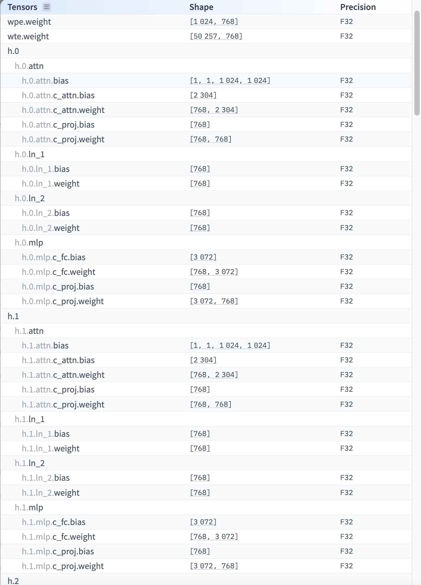

# Porting Pytorch Models into Candle

## Introduction:
Porting a model from Pytorch to Candle is surprisingly simple. Pytorch's `.safetensors` is just dictionary mapping tensor names to its
weights. The core of the work is just re-implementing the layers with the same naming convention as specified in the
`.safetensors` file.


### Inference:
```bash
cargo run --release -- --model-path ./model.safetensors --device metal --prompt "My name is Teven and I"
```

Output:
```
Model loaded successfully!
My name is Teven and I am a student at the University of California, Berkeley. I am a member of the American Association of University Professors. I am a member 
of the American Association of University Professors. I am a member of the American Association of University Professors. I am a member of the American Associati
on of University Professors. I am a member of the American Association of University Professors. I am a member of the American Association of University Professo
rs. I am a member of the American Association of University Prof
```

### Porting GPT2
Weights can be found here: https://huggingface.co/openai-community/gpt2/blob/main/model.safetensors

Huggingface has a pretty nifty feature that quickly shows the architecture of a model and how its tensors are named.
If you click on this button:


This widget will pop up:


Here we can see how each module is named and the shape of their weights.

GPT2 is quite simple, it has:
- a `word_position_embedding` module named `wpe`
- a `word_token_embedding` module named `wte`.
- 12 multi head attention modules each prefixed with `h` followed by the head number.
    i.e `h.0` represents the weights for the first head, `h.1` are the weights to the second head ..etc
    - Each head has 4 submodules:
        - An attention module named `attn`
        - Two layer norm modules named `ln_1` and `ln_2`
        - A feed forward module named `mlp`

Now we just have to reimplementing every module and assigning them the appropriate names!
Implementation can be found in `./src/gpt2/model.rs`


## TODO:
- Add a Config Struct makes instead of hard coding.
- Add flash attention
- Give GPT2 chat cabilities with chat Templating
